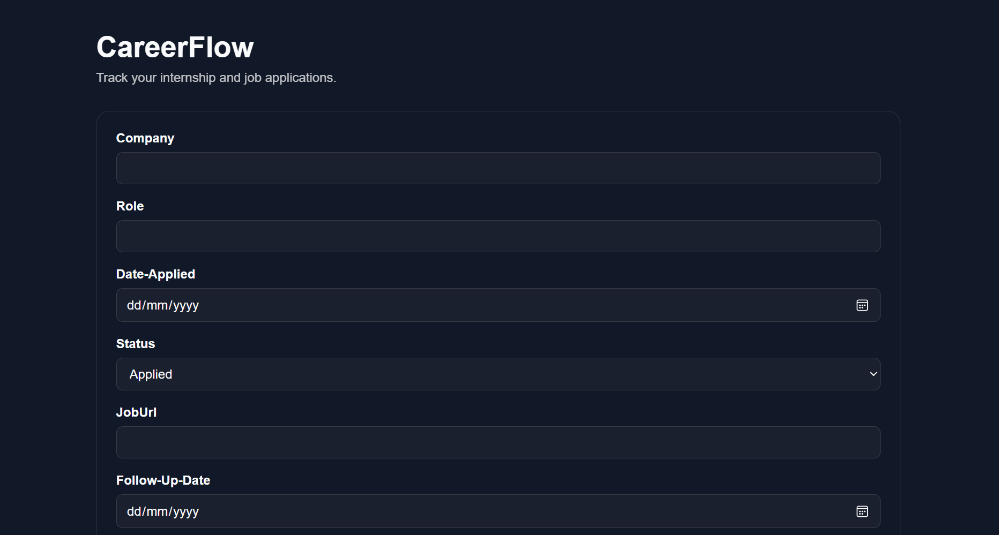
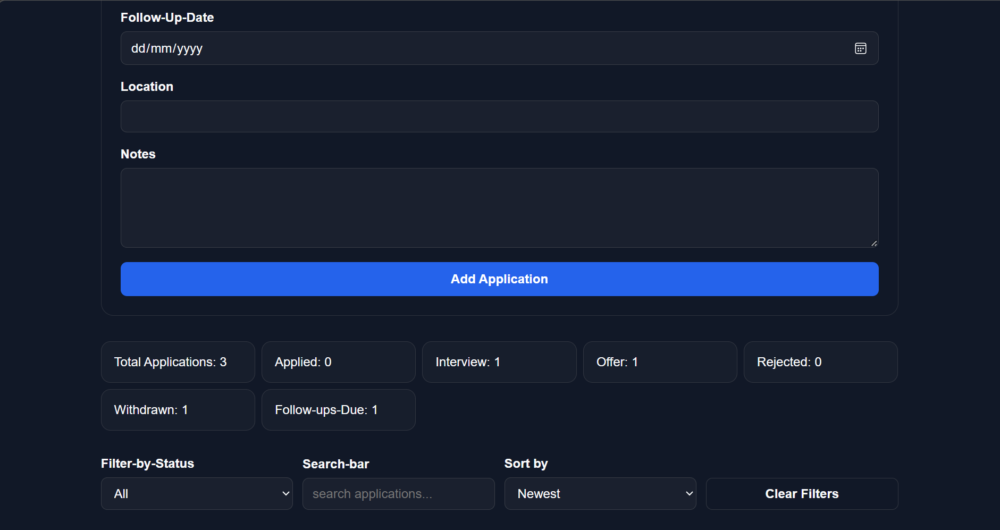
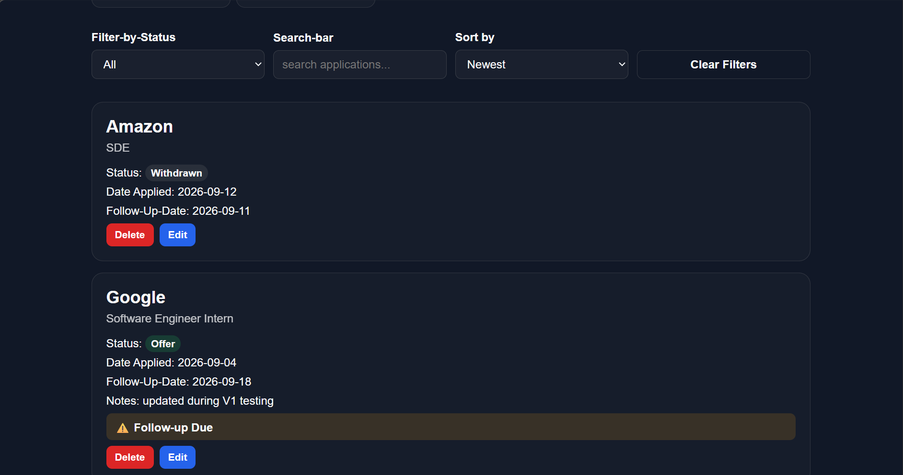

# CareerFlow

CareerFlow is a full-stack job application tracking web application built to help students and recent graduates organize their internship and job search in one place.

It allows users to track applications, update application statuses, manage follow-up dates, search and filter applications, and monitor their overall application progress through a dashboard.

## Features

- Create, view, edit, and delete job applications
- Track application status including Applied, Interview, Offer, Rejected, and Withdrawn
- Automatically suggest a follow-up date 14 days after applying
- Highlight overdue follow-ups
- Search applications by company or role
- Filter applications by status or follow-up status
- Sort applications by date added, application date, or company name
- View dashboard statistics for application progress
- Responsive design with light and dark mode support
- Clear loading, success, error, and empty-state feedback

## Tech Stack

### Frontend

- React
- TypeScript
- Vite
- CSS

### Backend

- Java
- Spring Boot
- Spring Data JPA
- Maven

### Database

- PostgreSQL

### Tools

- Git
- GitHub
- VS Code

## Project Architecture

CareerFlow follows a full-stack client-server architecture:

```text
React + TypeScript Frontend
        ↓ HTTP / REST API
Spring Boot Backend
        ↓ Spring Data JPA
PostgreSQL Database
```

The frontend sends HTTP requests to the backend using `fetch`.

The Spring Boot backend processes requests through:

```text
Controller
    ↓
Service
    ↓
Repository
    ↓
PostgreSQL
```

Spring Data JPA handles communication between the backend and PostgreSQL.

## API Endpoints

| Method | Endpoint | Purpose |
|---|---|---|
| POST | `/applications` | Create a new application |
| GET | `/applications` | Get all applications |
| GET | `/applications/{id}` | Get one application by ID |
| PUT | `/applications/{id}` | Update an existing application |
| DELETE | `/applications/{id}` | Delete an application |

## Running Locally

### Prerequisites

Make sure you have installed:

- Java
- Node.js and npm
- PostgreSQL
- Git

### Database

Create a PostgreSQL database named:

```text
careerflow
```

### Backend

Navigate to the backend folder:

```powershell
cd careerflow-backend
```

Set your PostgreSQL credentials as environment variables:

```powershell
$env:DB_USERNAME = "your-postgresql-username"
$env:DB_PASSWORD = "your-postgresql-password"
```

Start the Spring Boot backend:

```powershell
.\mvnw.cmd spring-boot:run
```

The backend runs on:

```text
http://localhost:8080
```

### Frontend

Open another terminal and navigate to the frontend folder:

```powershell
cd careerflow-frontend
```

Install the frontend dependencies:

```powershell
npm install
```

Start the Vite development server:

```powershell
npm run dev
```

Open the local URL shown by Vite in your browser.

## Screenshots

### Application Form



### Dashboard and Application Controls



### Application Tracking



## Future Improvements

Planned improvements for future versions include:

- User authentication and individual accounts
- Personalized application data for each user
- Follow-up reminders and notifications
- Additional dashboard analytics
- Expanded application tracking features
